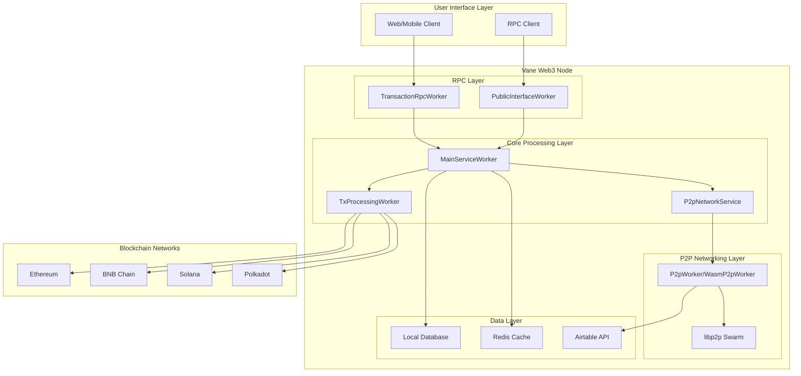
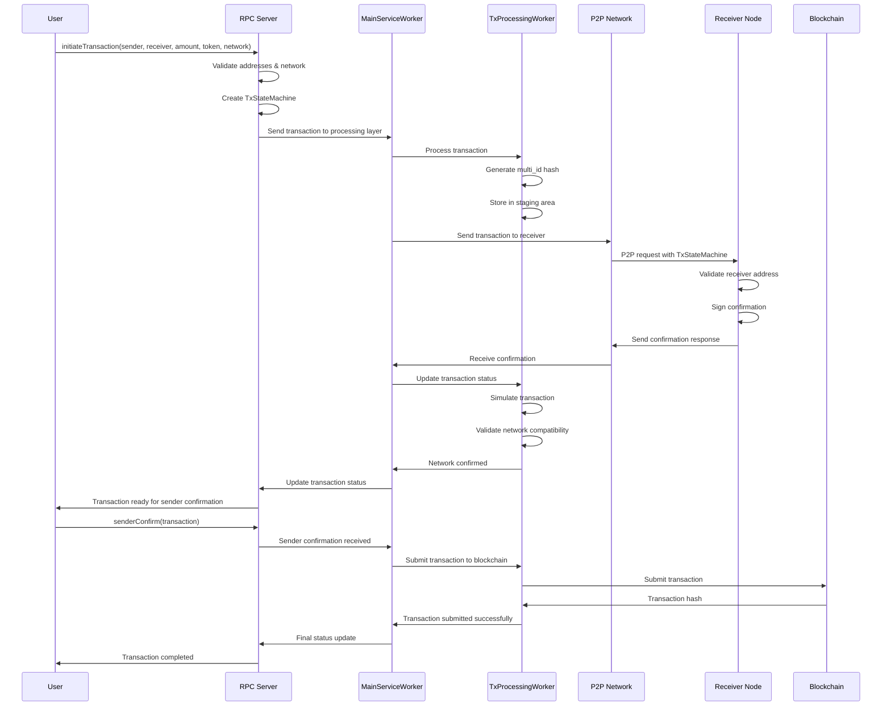
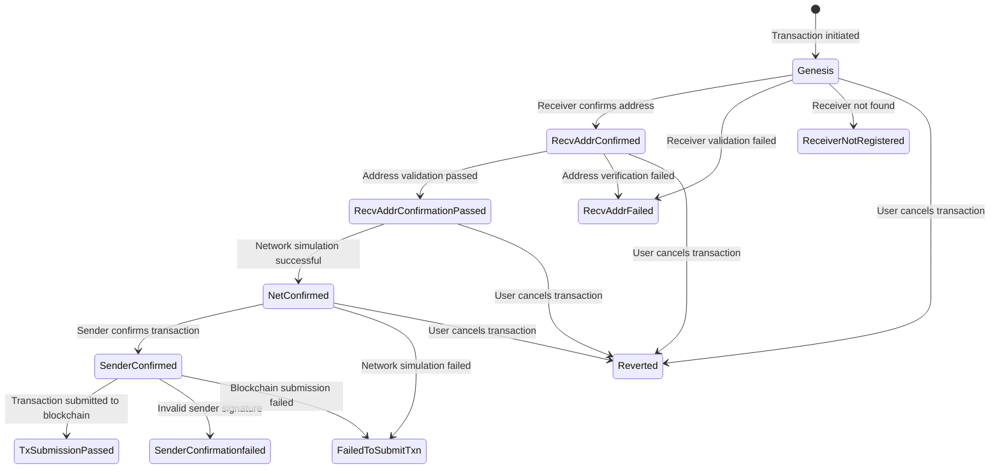

# Vane Web3 Technical Architecture

## Overview

Vane Web3 is a sovereign custodian implementation that provides a safety net for Web3 transactions, preventing fund loss from address errors and network mismatches through multi-party verification and confirmation.

## High-Level Architecture



## Component Flow Diagram

### Transaction Processing Flow



## Core Components

### 1. MainServiceWorker
**Purpose**: Central orchestrator that coordinates all system components

**Key Responsibilities**:
- Manages communication channels between layers
- Coordinates transaction flow between RPC, P2P, and processing layers
- Handles both native and WASM environments
- Manages Redis and database connections

**Key Methods**:
- `new()` - Initialize all components
- `run()` - Start the main service loop
- `e2e_new()` - Setup for end-to-end testing

### 2. TransactionRpcWorker
**Purpose**: JSON-RPC server providing transaction interface

**Key Responsibilities**:
- Exposes RPC methods for transaction operations
- Handles user authentication and validation
- Manages transaction state updates
- Provides WebSocket subscriptions for real-time updates

**Key RPC Methods**:
- `initiateTransaction()` - Start new transaction
- `senderConfirm()` - Sender confirmation
- `receiverConfirm()` - Receiver confirmation
- `revertTransaction()` - Cancel transaction
- `subscribeTxUpdates()` - Real-time updates

### 3. TxProcessingWorker
**Purpose**: Core transaction processing and validation engine

**Key Responsibilities**:
- Validates sender and receiver addresses cryptographically
- Simulates transactions before execution
- Manages transaction state machine
- Handles multi-chain transaction submission

**Key Features**:
- Address verification using cryptographic signatures
- Transaction simulation for fee estimation
- Multi-chain support (Ethereum, BNB, Solana, Polkadot)
- State machine management for transaction lifecycle

### 4. P2P Network Layer
**Purpose**: Peer-to-peer communication for transaction verification

**Components**:
- **P2pWorker/P2pNetworkService**: Manages libp2p swarm
- **WasmP2pWorker**: WASM-compatible P2P implementation
- **Swarm**: libp2p networking core

**Key Features**:
- Peer discovery via Airtable API
- Secure message routing using libp2p
- Request-response protocol for transaction verification
- Support for both native and WASM environments

### 5. Data Layer
**Purpose**: Persistent storage and caching

**Components**:
- **LocalDbWorker**: SQLite database operations
- **OpfsRedbWorker**: WASM-compatible database
- **Redis**: Distributed caching and state management
- **Airtable**: Peer discovery and registration

**Key Features**:
- Transaction history and statistics
- Peer information storage
- User account management
- Port configuration storage

## Transaction State Machine



## Data Flow Architecture

### 1. Transaction Initiation Flow
```
User Input → RPC Validation → TxStateMachine Creation → Processing Layer → P2P Network
```

### 2. Receiver Verification Flow
```
P2P Request → Receiver Node → Address Validation → Cryptographic Signature → Response
```

### 3. Transaction Execution Flow
```
Sender Confirmation → Transaction Simulation → Blockchain Submission → Status Update
```

## Security Features

### 1. Cryptographic Verification
- **Address Validation**: Uses cryptographic signatures to verify address ownership
- **Multi-ID Generation**: Creates unique transaction identifiers from sender/receiver addresses
- **Signature Recovery**: Validates signatures against recovered addresses

### 2. Transaction Safety
- **Pre-execution Simulation**: Simulates transactions before submission
- **Multi-party Confirmation**: Requires both sender and receiver confirmation
- **Network Validation**: Ensures correct network selection

### 3. P2P Security
- **libp2p Encryption**: End-to-end encrypted communication
- **Peer Authentication**: Verified peer identity through cryptographic keys
- **Request-Response Protocol**: Structured message exchange with timeouts

## Deployment Architecture

### Native Environment
```
┌─────────────────┐    ┌─────────────────┐    ┌─────────────────┐
│   User Client   │    │  Vane Web3 Node │    │  Blockchain     │
│                 │    │                 │    │                 │
│ - RPC Client    │◄──►│ - RPC Server    │    │ - Ethereum      │
│ - Web Interface │    │ - P2P Network   │◄──►│ - BNB Chain     │
│ - Mobile App    │    │ - Tx Processing │    │ - Solana        │
└─────────────────┘    │ - Local DB      │    │ - Polkadot      │
                       │ - Redis Cache   │    └─────────────────┘
                       └─────────────────┘
```

### WASM Environment
```
┌─────────────────┐    ┌─────────────────┐    ┌─────────────────┐
│   Web Browser   │    │  WASM Module    │    │  External APIs  │
│                 │    │                 │    │                 │
│ - JavaScript    │◄──►│ - WASM Core     │    │ - Airtable API  │
│ - Web Interface │    │ - P2P WASM      │◄──►│ - Blockchain    │
│ - WebRTC        │    │ - OPFS Storage  │    │   RPC Endpoints │
└─────────────────┘    └─────────────────┘    └─────────────────┘
```

## Performance Considerations

### 1. Caching Strategy
- **Moka Cache**: In-memory caching for transaction states
- **LRU Cache**: WASM-compatible caching for browser environments
- **Redis**: Distributed caching for multi-node deployments

### 2. Database Optimization
- **SQLite**: Local storage for single-node deployments
- **OPFS**: Browser-based storage for WASM environments
- **Prisma ORM**: Type-safe database operations

### 3. Network Optimization
- **Connection Pooling**: Reuse P2P connections
- **Request Batching**: Batch multiple operations
- **Timeout Management**: Configurable timeouts for network operations

## Error Handling

### 1. Transaction Failures
- **Address Validation Errors**: Invalid or mismatched addresses
- **Network Errors**: Incorrect network selection
- **Signature Errors**: Invalid cryptographic signatures
- **Blockchain Errors**: Transaction submission failures

### 2. Network Failures
- **P2P Connection Errors**: Peer discovery and connection issues
- **RPC Errors**: Client-server communication failures
- **Database Errors**: Storage and retrieval failures

### 3. Recovery Mechanisms
- **State Machine Rollback**: Revert to previous valid state
- **Retry Logic**: Automatic retry for transient failures
- **Error Logging**: Comprehensive error tracking and reporting

## Monitoring and Observability

### 1. Logging
- **Structured Logging**: JSON-formatted log entries
- **Log Levels**: Debug, Info, Warn, Error levels
- **File and Console**: Dual logging output

### 2. Metrics
- **Transaction Statistics**: Success/failure rates
- **Performance Metrics**: Response times and throughput
- **Network Metrics**: P2P connection health

### 3. Health Checks
- **Component Health**: Individual service health monitoring
- **Database Health**: Connection and query performance
- **Network Health**: P2P network connectivity status

This architecture provides a robust, secure, and scalable foundation for safe Web3 transactions with comprehensive error handling and monitoring capabilities. 